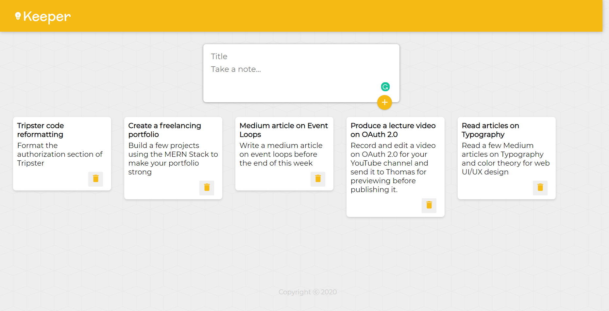

# GoogleKeepClone
A Google Keep Clone (without Authentication). This is a MERN Stack Web Application. The user can add and delete notes.

## Requirements
### You must have the following installed on your system before you can run this project on your system:-
#### 1. NodeJS
#### 2. NPM
#### 3. MongoDB

## Usage
### Navigate to the "Backend" and run the following commands:-
#### npm install (this will install all the dependencies and create the node-modules folder for you in the Backend)
#### npm start (this will start the server locally on your system)

